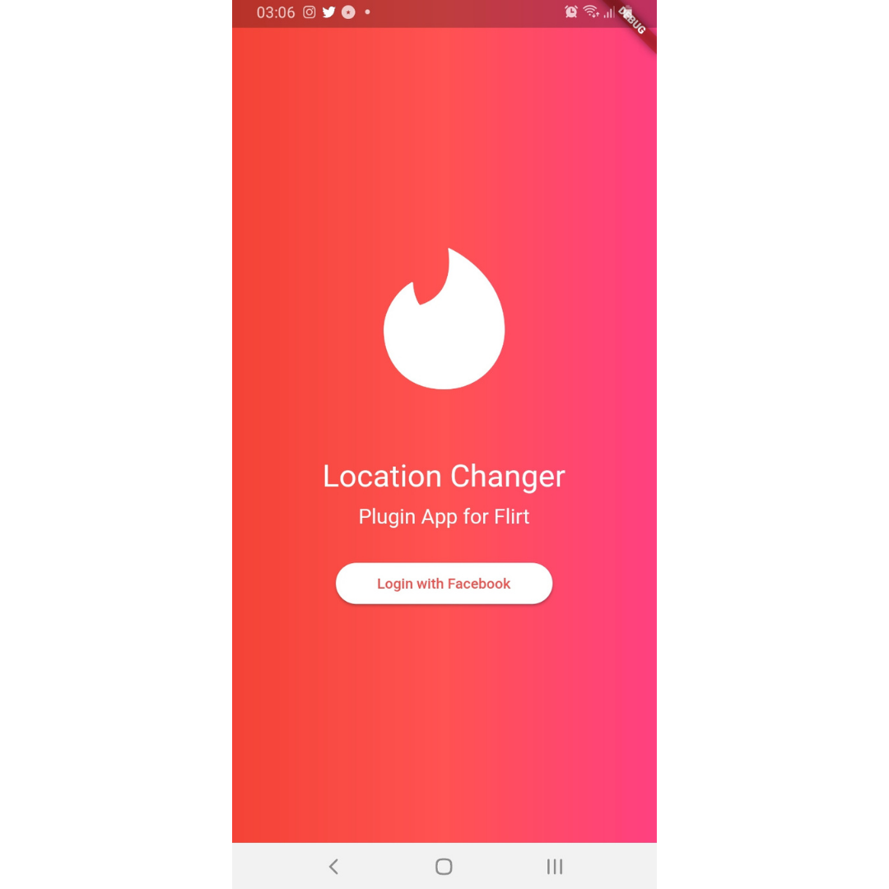

<h1 align="center">
 
  Challenge - 01
 
 

</h1>

 Desafio realizando através da proposta do curso da Flutterando.  
    O conceito do trabalho, foi realizar o desenvolvimento de um layout, com cores, botões.

[//]: # (Adicione seus gifs / imagens aqui:)

  <h1 align="center">
    
  </h1>

## **Languages and Tools:**
[//]: # (Adicione os recursos do seu projeto aqui:)

- <code></code> **Flutter**
- <code></code> **Dart**

